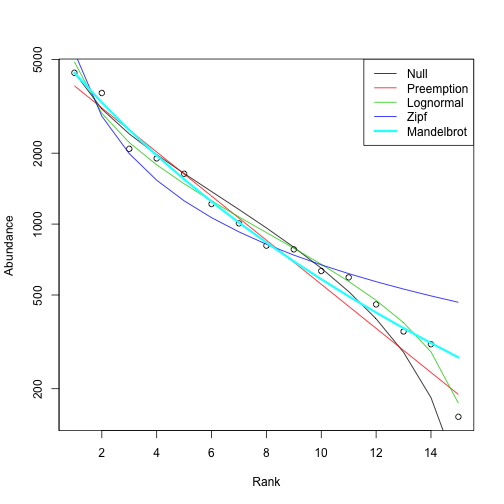

## Macroecology - testing the species-abundance distribution


```r
library(rbison)
library(ggplot2)
library(plyr)
library(doMC)
```


Define a vector of species names


```r
mynames <- c("Helianthus annuus", "Pinus contorta", "Poa annua", "Madia sativa", 
    "Arctostaphylos glauca", "Heteromeles arbutifolia", "Symphoricarpos albus", 
    "Ribes viburnifolium", "Diplacus aurantiacus", "Salvia leucophylla", "Encelia californica", 
    "Ribes indecorum", "Ribes malvaceum", "Cercocarpus betuloides", "Penstemon spectabilis")
```


Define a function to get data needed, here just the summary data, then pull out just the _total_ column and make a `data.frame` along with the input taxon name


```r
getdata <- function(x) {
    tmp <- bison(species = x, what = "summary")$summary
    data.frame(x, abd = tmp$total)
}
```


Get the data by passing each name to the `getdata` function


```r
out <- ldply(mynames, getdata)
```


Plot species-abundance distribution using the `radfit` function in vegan


```r
library(vegan)
plot(radfit(out$abd))
```

 

