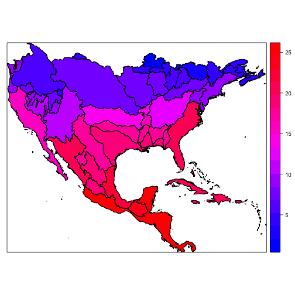
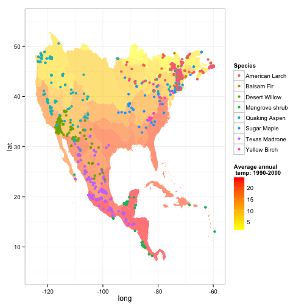
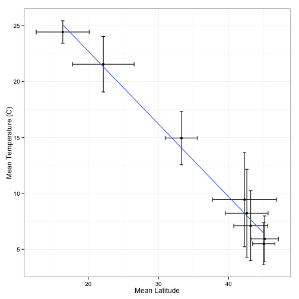
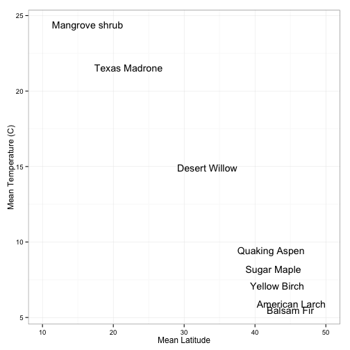

Overlaying data sources
========================================================

Maps can also be created with multiple data sources.  Here we'll combine tree species data with average temperature data, using  `rWBclimate` that accesses data from the World Bank climate data api.


```r
library(rWBclimate)
### Create path to store kml's
dir.create("~/kmltmp")
```


```r
options(kmlpath = "~/kmltmp")

usmex <- c(273:284, 328:365)
usmex.basin <- create_map_df(usmex)
```

```r


## Download temperature data
temp.dat <- get_historical_temp(usmex, "decade")
temp.dat <- subset(temp.dat, temp.dat$year == 2000)


# create my climate map
usmex.map.df <- climate_map(usmex.basin, temp.dat, return_map = F)


## Grab some species occurrence data for the 8 tree species.

splist <- c("Acer saccharum", "Abies balsamea", "Arbutus texana", "Betula alleghaniensis", 
    "Chilopsis linearis", "Conocarpus erectus", "Populus tremuloides", "Larix laricina")
out <- occ(query = splist, from = "gbif", limit = 100)

## Now just create the base temperature map
usmex.map <- ggplot() + geom_polygon(data = usmex.map.df, aes(x = long, y = lat, 
    group = group, fill = data, alpha = 0.8)) + scale_fill_continuous("Average annual \n temp: 1990-2000", 
    low = "yellow", high = "red") + guides(alpha = F) + theme_bw()

out <- fixnames(out)
out_df <- occ2df(out)
## And overlay of gbif data
usmex.map + geom_point(data = out_df, aes(y = latitude, x = longitude, group = name, 
    colour = name)) + xlim(-125, -59) + ylim(5, 55)
```

```
## Warning: Removed 151 rows containing missing values (geom_point).
```

 


Now we've plotted the data, but what if we want to get out the temperature at each point?  This is essentially performing an intersection between the temperature layers and the species occurrence points.


```r
library(devtools)
library(rWBclimate)
library(rgbif)
library(plyr)
library(ggplot2)
library(sp)


##### Converts decimal latitude to a spatial object with WGS84 coords
to_pts <- function(x, y) {
    ### check valid coords
    xy <- data.frame(cbind(x, y))
    xy <- xy[(xy$x < 180) & (xy$x > -180), ]
    xy <- xy[(xy$y < 90) & (xy$y > -90), ]
    return(SpatialPoints(xy, proj4string = CRS("+proj=longlat +datum=WGS84")))
}


### Download map polygons
usmex <- c(273:284, 328:365)
usmex.basin <- create_map_df(usmex)
```


```r

## Download temperature data
temp.dat <- get_historical_temp(usmex, "decade")
temp.dat <- subset(temp.dat, temp.dat$year == 2000)

## Create a spatial polygon dataframe binding kml polygons to temperature
## data
temp_sdf <- kml_to_sp(usmex.basin, df = temp.dat)

### Let's plot it just to compare to our KML plots
spplot(temp_sdf, "data", col.regions = rainbow(100, start = 4/6, end = 1))
```

 

```r

### Species name list
splist <- c("Acer saccharum", "Abies balsamea", "Arbutus texana", "Betula alleghaniensis", 
    "Chilopsis linearis", "Conocarpus erectus", "Populus tremuloides", "Larix laricina")
## Common name list
cname <- c("Sugar Maple", "Balsam Fir", "Texas Madrone", "Yellow Birch", "Desert Willow", 
    "Mangrove shrub", "Quaking Aspen", "American Larch")

## Set up the keys to download from GBIF
keys <- sapply(splist, function(x) name_backbone(name = x, kingdom = "plants")$speciesKey, 
    USE.NAMES = FALSE)

### This may take awhile, it's lots of data
mdat <- occ_search(taxonKey = keys, limit = 200, return = "data", georeferenced = TRUE)

### Convert gbif floating points to spatial polygons
newlist <- list()
for (i in 1:length(cname)) {
    newlist[[cname[i]]] <- to_pts(mdat[[i]]$longitude, mdat[[i]]$latitude)
}


N <- vector()
spp <- vector()
dat <- vector()
coords <- matrix(NA, ncol = 2, nrow = 0)
### Get averages
for (i in 1:length(newlist)) {
    tmp_t <- over(newlist[[i]], temp_sdf)$data
    coords <- rbind(coords, cbind(newlist[[i]]$x[!is.na(tmp_t)], newlist[[i]]$y[!is.na(tmp_t)]))
    N[i] <- sum(!is.na(tmp_t))
    tmp_t <- tmp_t[!is.na(tmp_t)]
    
    dat <- c(dat, tmp_t)
    spp <- c(spp, rep(cname[i], length(tmp_t)))
    
}


coords <- data.frame(coords)
coords$spp <- as.factor(spp)
coords$dat <- dat
colnames(coords) <- c("Longitude", "Latitude", "Species", "Temp")


usmex.map.df <- climate_map(usmex.basin, temp.dat, return_map = F)

usmex.map <- ggplot() + geom_polygon(data = usmex.map.df, aes(x = long, y = lat, 
    group = group, fill = data, alpha = 0.8)) + scale_fill_continuous("Average annual \n temp: 1990-2000", 
    low = "yellow", high = "red") + guides(alpha = F) + theme_bw()

usmex.map + geom_point(data = coords, aes(y = Latitude, x = Longitude, group = Species, 
    colour = Species)) + xlim(-125, -59) + ylim(5, 55)
```

 

```r


ggplot(coords, aes(x = Species, y = Temp)) + geom_boxplot() + coord_flip()
```

 

```r

summary_data <- ddply(coords, .(Species), summarise, mlat = mean(Latitude), 
    mtemp = mean(Temp), sdlat = sd(Latitude), sdtemp = sd(Temp))


ggplot(summary_data, aes(x = mlat, y = mtemp)) + geom_point() + geom_errorbar(aes(ymin = mtemp - 
    sdtemp, ymax = mtemp + sdtemp, width = 0.5)) + geom_errorbarh(aes(xmin = mlat - 
    sdlat, xmax = mlat + sdlat, width = 0.5)) + stat_smooth(method = "lm", se = F) + 
    xlab("Mean Latitude") + ylab("Mean Temperature (C)") + theme_bw()
```

 

```r

ggplot(summary_data, aes(x = mlat, y = mtemp, label = Species)) + geom_text() + 
    xlab("Mean Latitude") + ylab("Mean Temperature (C)") + theme_bw() + xlim(10, 
    50)
```

 


